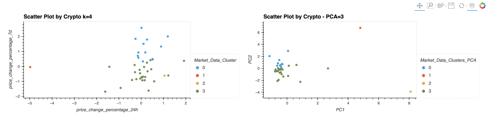

# 10_Crypto_Investments

### This project aims to build a novel approach to assembling investment crypto portfolio that visually demonstrates the multiple factors that impact performance of the cryptocurrencies. The principal component analysis (PCA) was ultimately used to best visualize the portfolio performance.

The original data contains 41 cryptos and 7 different price change metrics in percentages: 24h, 7-day, 14-day, 30-day, 60-day, 200-day, and 1 year.

---

## Technologies

This project leverages python 3.9 and Jupyter lab notebook was used to run all analysis.

---

## Installations

Before running the application first import the following libraries and dependencies.

```python
import pandas as pd
import hvplot.pandas
from path import Path
from sklearn.cluster import KMeans
from sklearn.decomposition import PCA
from sklearn.preprocessing import StandardScaler
```

---

## Data Preparation

It is clear that by reading and visualizing the portfolio in its original form, not many conclusions can be drawn about its performance as coins had drastly different performances, making it difficult to compare and analyze. Therefore, the `StandardScaler` module from scikit-learn was used to normalize the data and the `fit_transform` function was used to do so.

---

## K value and Clustering (Original Data and PCA)

Initially, using the original dataset, we found the best k-value by using the elbow method, which is 4. Then, initializing the K-Means model using the best k-value, we were able to plot the data. However, the clusters were not very well defined so it is hard to see the detailed crypto performances.

Then, the principal component analysis (PCA) technique was applied to reduce the number of dimensions in this dataset. For this instance, we used the PCA model to reduce to only three principal components. The following code applies dimensionality reduction on our preprocessed dataset:

```python
crypto_pca_data = pca.fit_transform(df_market_data_scaled)
```

We also applied the `explained_variance_ratio_` attribute from the `PCA` model to retrieve the explained variance, which turned out to be 0.89503166. This means components together contain 89.5% of the original information.

Below is a side-by-side comparison of the two scatter plots, where the left plot used the original data and the right plot is after applying the PCA technique:



Both the original data and the PCA data produced the k-value of 4 using the elbow method. However, the PCA plot shows a better visualization of clusters, therefore, performance of different cryptos in the portfolio. The clusters are more clearly defined and don't really overlap with each other. It is a better method to find clusters from your data and draw conclusions.
